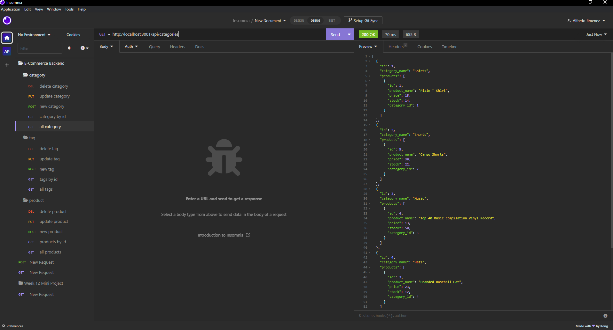

# E-Commerce Back-End

## Description

The purpose of this application is to work as a back-end for a e-commerce site. It will be able to connect to the database using Sequelize and with the schema and seeds commands the user creates the seeded database. The user must use Insomnia to test all the routes in the application. The user will be able to get,create, update, and delete all three sets od data.

## Installation

To run this application you will need to install mysql2, express, inquirer, and also dotenv.
URL: https://github.com/AlfredoJi/e-commerce_back_end

## Usage

The user must create the schema from the mySQL shell before seeding and testing the application. After creating the database you can seed it with "npm run seed". After seeding the database you can start the application with "npm start". From there the user will Insomina to test all the routes and to get that data.
Walkthrough Video: https://drive.google.com/file/d/1zBnbjod_9ECAolFdR59yCiDlq7k0SYOY/view

## Image

